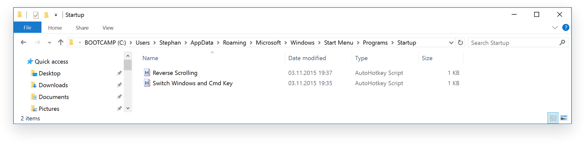

# Customize Windows for Mac users

These are some tools/shortcuts/scripts which make using Windows easier to use for daily Mac users.

## Reverse Scrolling (use "Natural Scrolling")
The script `Reverse Scrolling.ahk` reverses the default Windows scrolling to mimic the "natural" scrolling from Mac (scroll upwards = content moves upwards).

## Switch Windows and ctrl key
The script `Switch Windows and Cmd Key.ahk` will result in switching  <kbd>ctrl</kbd> with <kbd>Windows</kbd> (Mac's <kbd>cmd ⌘</kbd> key).

That means pressing <kbd>cmd ⌘</kbd> + <kbd>C</kbd> will actually copy what you wanted to copy.

## Installation

### 1. Install AutoHotKey
Go to [ahkscript.org](http://ahkscript.org/) and download the program AutoHotKey. This can control the keyboard on Windows and therefore let's us do some cool things

### 2. Download the scripts
- Download [Switch Windows and Cmd Key.ahk](https://raw.githubusercontent.com/stephanbogner/Customize-Windows-For-Mac-Users/master/Autohotkey%20Scripts/Switch%20Windows%20and%20Cmd%20Key.ahk)
- Download [Reverse Scrolling.ahk](https://raw.githubusercontent.com/stephanbogner/Customize-Windows-For-Mac-Users/master/Autohotkey%20Scripts/Reverse%20Scrolling.ahk)

### 3. Start scripts on startup
Put the scripts into `C: ▶ Users ▶ Your Username ▶ AppData ▶ Roaming ▶ Microsoft ▶ Windows ▶ Start Menu ▶ Programs ▶ Startup` and they will start automatically when you boot Windows.

### 4. Done
Enjoy your Mac feeling on your Windows machine.